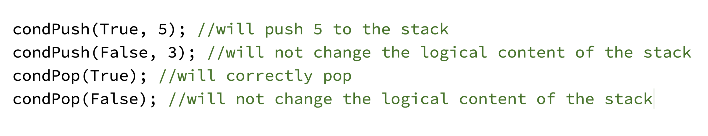
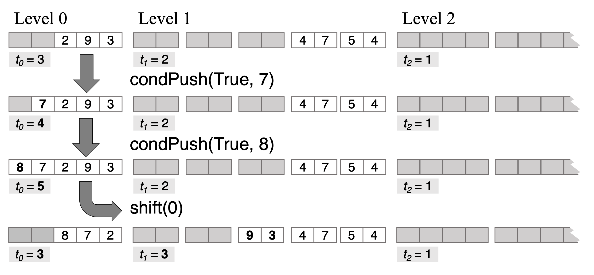

# Outline

This work details experiences in learning and implementing oblivious
stack [@zahur2013circuit] with the EMP toolkit [@emp-toolkit]. The
source code of our project is available [@obvs_git]. Our presentation is
structured as follows:

We begin in [2](#sec:intro){reference-type="ref+Label"
reference="sec:intro"} by introducing oblivious stack, its motivation,
and highlighting its differences from the standard (non-private) stack
implementation. We introduce the EMP toolkit, which we use as a
framework for our implementation.

Then, [3](#sec:design){reference-type="ref+Label"
reference="sec:design"}, Oblivious Stack Design, will walk through all
the functions of the oblivious stack and explain how they work and why
they are used.

Third, [4](#sec:impl){reference-type="ref+Label" reference="sec:impl"},
Implementation, will walk through the data structures used to implement
the stack and how each of the functions are implemented practically.

Finally, we discuss the performance of our implementation and noteworthy
implementation details in [5](#sec:perf){reference-type="ref+Label"
reference="sec:perf"}.

# Introduction {#sec:intro}

A stack is a linear data structure that follows the Last-In, First-Out
(LIFO) principle, meaning the last element added to the stack is the
first one to be retrieved (and removed from stack). These operations are
implemented by `push` and `pop` functions.

However, implementing it in secure computation, or MPC (Multi-Party
Computation), is somewhat challenging. MPC must hide all intermediate
values of the execution. Thus all internal values, as well as the
program flow that depends on internal values, must be hidden from all
parties executing the program.

As it turns out, hiding the program flow is the most challenging aspect
of MPC. A popular way to run MPC is by executing programs represented as
circuits, e.g. Boolean circuits. This is because the program flow is
preset so the encrypted internal values do not need to be known to
manage the flow of the program. However, this comes with a major
downside: conditionals are extremely expensive in circuits. To implement
a conditional in a circuit (either a plaintext circuit or an MPC
execution), both branches of the conditional must be executed. The
result is then selected according to the value of the selection wire.

This approach leads to exponential growth of execution time if nested
conditionals occur. A good trade off in MPC is to have straightline
programs (efficiently implementable as circuits), that can operate with
conditional/oblivious data structures. Note, this approach may not
*always* convert a function to a small circuit, but it may improve
performance in many functions. In our case (secure computation), it is
useful to have a stack whose operations (`push` and `pop`) take an
additional Boolean parameter that controls whether or not the operation
is actually performed.

EMP [@emp-toolkit] is a toolkit that allows users to write MPC programs
in `C++`. It compiles `C++` programs into circuits that can be run
efficiently. EMP handles conditionals as described above: by generating
and executing both branches. In this paper, we are concerned with
implementing the stack efficiently in MPC using functions and data
structures contained in EMP. It is convenient for us to introduce the
notation of *oblivious* values, such as oblivious integer or oblivious
Boolean. These are the values that are not known to either party during
evaluation, but are jointly known because they are secret-shared in some
way. EMP extensively uses oblivious values; it includes classes
`Integer`, `Bit`, etc. that implement oblivious integer, bit, etc. In
programming MPC, we need to operate with both plaintext and oblivious
values.

# Oblivious Stack Design {#sec:design}

`condPop` (conditional `pop`) and `condPush` (conditional `push`) are
the main functions of the stack: they are what the user calls in order
to `push` and `pop` objects. `condPush` takes in the value being
`push`ed (an oblivious integer) and an oblivious bit, and returns
nothing. `condPop` takes in an oblivious bit and returns the `pop`ped
value (an oblivious integer). Internally, if `condPush` is called with a
false bit, it mechanically inserts the `push`ed value into the stack (to
hide the fact that no insertion takes place), but does not change the
(oblivious) pointers that keep the order of the stack. This is done by,
e.g., adding an oblivious value $0$ to the pointers). This effects no
change to the actual content of the stack, but follows the control flow
that is identical to the one where the element is logically inserted.
Similarly, if `condPop` is called with a false bit, it returns the value
at the top of the stack but does not change the pointers, keeping the
top value in the stack.

<figure id="fig:label" data-latex-placement="H">

<figcaption>Illustration of the <code>condPush</code> and
<code>condPop</code> function calls</figcaption>
</figure>

A naïve way to implement oblivious stack is to simply store it in an
array and keep an oblivious pointer to the top of the stack. However,
this is inefficient: because we are implementing the stack obliviously,
we would need to scan the entire stack every time we accessed it to
avoid revealing an access pattern to potential attackers. Additionally,
because stack operations are oblivious, no player actually knows the
state of the stack. That is, the stack's size, top location, etc., are
all encrypted. Therefore, there is no way of executing `condPush` or
`condPop` with this approach without accessing every single element.

An elegant solution to this is to store the stack in a *hierarchical*
data structure, allowing us to scan an array of only a small constant
size when we access the stack. This method was proposed
in [@zahur2013circuit]. We closely follow their algorithm.

That is, we represent the stack as a collection of arrays where each
successive array is multiplicatively (twice,0 in our algorithm) larger
than the previous one (thus array size grows exponentially in the
collection). The stack is organized so that the elements of the top of
the stack are always contained in the first (top) array. This allows all
of the `push` and `pop` operations to complete by scanning only the
first array. (As we explain later, it is sufficient to store only $5$
elements in this array). This means that every time we `push` or `pop`,
we only need to scan an array of size $5$, instead of scanning the
entire stack storage. However, because we only `push` and `pop`
into/from the top array, we need a method of distributing, storing and
accessing the values in the lower levels. The functions `shiftRight` and
`shiftLeft` take care of this[^1]: `shiftRight` and `shiftLeft` are
efficient functions that keep each level in a correct range of occupancy
so that we can `push` and `pop` from the first level only. They ensure
that if the top array is close to overflowing, the data gets moved to
lower larger arrays (by calling `shiftRight`), and conversely
`shiftLeft` moves the data up when needed so that it is always available
in the top array for a `pop`. The challenge is that these functions must
operate obliviously, without plaintext knowledge of the stack access
operations. This is because the information about the stack is all
encrypted and cannot (cheaply) be used as a conditional. A key idea,
introduced in  [@zahur2013circuit] is that this can be done obliviously
and efficiently according to a fixed schedule of movement operations,
described next.

<figure id="fig:label" data-latex-placement="H">

<figcaption>Visual representation of the
<code>shiftRight</code> function on level 0. <code>shiftRight(0)</code> is
called after every 2 <code>condPush</code> operations, as
long as level 0 contains 3 or more values.</figcaption>
</figure>

`shiftRight` is a function that shifts blocks of elements down from the
higher levels to the lower levels according to a fixed schedule of
movement operations. It is demonstrated in Figure 2. Recall, obliviously
accessing an array element involves scanning the entire array (and
executing in MPC a corresponding circuit of size proportional to array
size). The key to the efficiency of the hierarchical stack lies in the
fact that we shift *in blocks*. The improvement comes from needing to
traverse the array once for each *block* (of elements) as opposed to
once for each element. Indeed, element $j$ of a block is always read
from and written to the $j$-th position after the first element of the
block, eliminating the need to scan the array for any block element
except for the first one.

For level $i$, `shiftRight` shifts block of size $2^{i+1}$ elements down
to level $i+1$. For example, `shiftRight` moves $2$ *consecutive*
elements (as one block!) down from level 0 to level $1$, and $4$ such
elements down from level $1$ to level $2$. To highlight the savings from
block-based movement, notice that if we shift right a block from level
10 to level 11, we traverse level 10 only once, instead of 2,048 times
of if we moved elements individually.

`shiftRight` is called on a schedule: for a level $i$ it is called after
every $2^{i+1}$ `push`es. It obliviously moves the data to the lower
array if such a move is needed (i.e. the higher array is getting full).
`shiftLeft` schedule, operation and tasks are symmetric to `shiftRight`.

Crucially, this algorithm ensures that the stack can accept any sequence
of `push`es and `pop`s. This is because shifting will move elements *to*
a level (from below) when it is too empty after `pop`ping or shifting,
and shift elements *away* (down) when the level is too full after
`push`ing or shifting. Indeed, the maximal data movement rate provided
by shifting is greater than that of `push` and `pop` operations: in the
worst case, a sequence of $K$ true `push`es (i.e. `push`es called with
true bits) `push`es $K$ elements. At the same time `shiftRight` will be
called at least $\lfloor K/2^i \rfloor$ times for each level i, moving
$2^i$ elements with each shift. $K/2^i \cdot 2^i$ is equal to $K$,
meaning that for every $K$ `push`es, each level will shift around $K$
elements down. This keeps the number of elements in each level stable.
Similarly, this is also the case for $K$ `pop`s in a row.

The performance of our implementation of this algorithm is analyzed
in [5](#sec:perf){reference-type="ref+Label" reference="sec:perf"}.

# Implementation {#sec:impl}

In this section, we discuss lower-level implementation details and
decisions that we made.

We used a Standard Template Library (STL) `Vector` of IntArrays of
increasing size as the hierarchy of storage arrays. We will have
$\lceil \log (N) \rceil$ of arrays to support a stack of up to $N$
elements. An IntArray is a vector of Integers (oblivious integers). The
Integer class is included in EMP. It includes mathematical operations,
bit-wise operations, and additional efficient functions that can help
with writing programs. IntArray is an auxiliary class written by us that
implements an oblivious array of Integers, with corresponding accessor
functions. IntArrays can be indexed and written to using both plaintext
and oblivious indices. Accessing and writing using plaintext indices
takes $O(1)$ time, and using oblivious indices takes $O(N)$ time, where
$N$ is the length of the array. Each IntArray represents a level of the
stack.

An essential part of the algorithm are the pointers that allow us to
know where the head and tail of each level are. We create three
IntArrays of Integers (i.e. EMP oblivious integers): Heads, Tails, and
Lengths. These arrays are the same length as the number of levels in the
stack. For each level $i$, Heads\[i\] contains the index of the head of
the level, or the element in the level that was `push`ed first
chronologically. Tails\[i\] stores the index of the tail of the level,
or the first empty slot in the level. That is, Tails\[0\] points to the
empty slot on the top of the stack. Lengths\[i\] contains the number of
elements currently stored in level $i$. Heads, Tails, and Lengths are
sufficient to allow us to perform calculations to get the elements we
need for `push`es and `pop`s. Sometimes when shifts are called, the
elements need to \"wrap around\" the array in order to fit; to account
for this, Heads and Tails are (obliviously) modded by the length of the
array.

Now, we will walk through each function. First, `condPush`. The
`condPush` operation always pushes into the top level. To `condPush`,
the (oblivious) value is inserted at the index contained at Tails\[0\]
(which points to the next available empty slot on the top of the stack).
The oblivious bit B passed into `condPush` is then added to the values
at Tails\[0\] (mod $5$) and Lengths\[0\]. This works because, if B is 1,
a value will be inserted at the end of the first level. This means that
Tails\[0\] needs to be updated by one to represent the next empty space
in the stack, and Lengths\[0\] needs to be updated to represent the new
length of the array. Otherwise, if B is 0, 0 will be added to Tails\[0\]
and Lengths\[0\], and so the stack will not be changed. Indeed, the
location of the value that is written will still be seen as empty:
Tails\[0\] will still point to that location as the first unallocated
spot.

Like the `condPush` operation, the `condPop` operation always `pop`s
from the top level. To `condPop`, we subtract B from Tails\[0\] and
Lengths\[0\]. If $B = 1$, i.e. we are `pop`ping, both values will be
reduced by one (mod $5$ for Tails\[0\]). If B is 0, i.e. we are not
`pop`ping, Tails\[0\] and Lengths\[0\] will remain the same. The `pop`
operation always returns the Integer on the top of the stack, even if
$B=0$.

There are two global variables in the stack data structure:
`push_counter` and `pop_counter`. These variables are plaintext integers
that are increased by one each time `condPush` and `condPop` are called
respectively. They are used to run the scheduled oblivious shifts of the
data items. For each level $i$ in the stack, `shiftRight` is called if
`push_counter` mod $2^{i+1}$ is equal to 0. This ensures that
`shiftRight` is called once for every $2^{i+1}$ `push`es. Equivalently,
`shiftLeft` is called if `pop_counter` mod $2^{i+1}$ is equal to 0.

#### Efficient Oblivious Shifting.

We now describe our implementation of the procedure to efficiently
obliviously shift (move between our hierarchical arrays) a *block* of
elements, with only one scan of each of the source and destination
arrays. Remember that each level has 5 equally sized blocks. For each
block $j$ in level $i$, we (obliviously, controlled by an oblivious bit
set to $1$ only for the blocks needed to be moved) copy the $j$th and
$j+1$st blocks to an auxillary array `aux` that holds exactly 2 blocks.
This is done with a single pass over the source array at level $i$ at
the cost of $O(2^i)$ operations[^2]. `aux` is then copied obliviously in
the same fashion[^3] into level $i+1$, completing the shift.[^4]

At the implementation level, oblivious element moves between arrays are
achieved using calls to a `IntArray` member function `obliviousWrite`.
`obliviousWrite` takes in a plaintext index in the destination
array[^5], an oblivious bit, and an `Integer` (oblivious integer) value,
and writes the `Integer` into the the array it is called on, in the
position of the index that is passed in. We emphasize, `obliviousWrite`
writes directly to the destination index, and does not scan the
destination array.

`shiftLeft` performs the same process symmetrically: it shifts from the
top of array $i+1$ to the bottom of array $i$.

# Performance {#sec:perf}

The naïve stack design, where the stack is simply stored in an
array-like data structure with an oblivious pointer to the top of the
stack, is prohibitively slow. For all circuit-based MPC protocols, the
primary cost scales linearly with the number of gates. In a stack
implementation by a circuit, the cost depends on the maximum possible
number of elements in the stack. Because the stack is oblivious and we
don't want to reveal the access pattern to potential adversaries, the
naïve implementation scans the entire array of size $N$ for every `push`
or `pop`. Therefore, its total cost is $O(k\cdot N)$, where $k$ is the
number of `push` or `pop` operations. This could work for algorithms
that handle small amounts of data, but would be too slow otherwise.

Our implementation of the stack, however, runs a lot faster, with an
efficiency of $O(k\cdot \log N)$. This can be seen with the following
calculation: Each level $i$ is accessed at most $k/2^i$ times, because
we perform a right shift into level $i$ after every $2^i$ `push`es and a
left shift after $2^i$ `pop`s. However, because the size of the level
increases exponentially with $i$, so does the cost of shifting from that
level. The size of each block at level $i$ is $2^i$, meaning we need
$O(2^i)$ logic gates to shift it. Shifting large blocks at once (instead
of shifting their elements individually) greatly decreases the cost --
see "Efficient Oblivious Shifting"
in [4](#sec:impl){reference-type="ref+Label" reference="sec:impl"} for
discussion. Therefore, we need $O(k/2^i \cdot 2^i)$ = $O(k)$ gates to
operate shifting at each level. With $O(\log N)$ levels and $O(k)$ gates
needed for each level, the total cost is $O(k\cdot \log N)$. This is
significantly faster than the naïve version, especially as the size and
number of elements increase.

### Notes on implementation, performance and measurement. {#notes-on-implementation-performance-and-measurement. .unnumbered}

When I first wrote the code, it ran suspiciously quickly. It ran at a
sub-linear speed with very few gates. When oblivious code runs faster
than expected, it often signifies improper encoding or encryption. In
our case, the `Integer`s we were using to `push` were `PUBLIC`, meaning
that they were not encrypted for either Alice or Bob. This allowed the
compiler to optimize out a lot of operations. When I switched the
`Integer`s to being encrypted on Alice's side, the code ran at a more
expected speed.

However, the runtime grew almost linearly for the input sizes I
experimented with. The reason for this was that the linearly growing
component of the code was implemented inefficiently, and greatly
overpowered the component that scaled with $k\log N$.

To try to decrease the linear part of our code, I made some tweaks to
the code for efficiency: for example, I noticed that the oblivious
$\tt mod$ function was expensive because it performs division. To solve
this, I created our own oblivious $\tt mod$ function using subtraction
instead of division. This relies on the fact that in our protocol, the
numbers I are performing the $\tt mod$ operation on are never more than
twice the $\tt mod$ value. This decreased the number of gates in the
resulting circuit by a factor of three.

Additionally, I realized that oblivious multiplication was a large cost
and I was performing the same multiplication multiple times inside `for`
loops. To fix this, I created a variable with the multiplication result
and used it instead of performing the operation every time. This
additionally decreased the number of gates in the resulting circuit by a
factor of three.

After fixing these two things, the linear part of our code decreased
significantly, making it fit the $k\log N$ model much better. To test
our implementation, I performed $p$ `push`es and $p$ `pop`s. All tests
were run on a MacBook Air laptop with an Apple M3 4.05 GHz processor and
16GB of RAM. Here were our results:

   **Input Size (p)**   **Number of Gates**   **Time (seconds)**
  -------------------- --------------------- --------------------
          160               12,596,824              31.44
          320               26,645,616              69.30
          640               55,792,008              140.62
          1280              116,151,200             294.80
          2560              240,971,192             623.03
          5120              498,783,184            1270.80
         10240             1,030,719,976           2663.77

  : Number of gates in the circuit and execution times for varying input
  sizes

<figure id="fig:gates_growth" data-latex-placement="htbp">

<figcaption>Number of gates and real execution time vs input size. As
the plot shows, the number of gates and times in seconds correspond
almost exactly to each other.</figcaption>
</figure>

The cost in our implementation indeed grows according to $k \log N$, but
the linear component is still significant. Further code optimization
would improve performance and will make it match the asymptotics better.

[^1]: In this paper we interchangeably use the notation
    from [@pragmaticmpc] (a concise and intuitive overview of main MPC
    constructions;  [@pragmaticmpc] orders hierarchical arrays left to
    right, with the left being smallest) and [@zahur2013circuit], which
    orders top down, with the top array being smallest. Thus, e.g., our
    `shiftRight` function shifts data to the lower, larger, array.

[^2]: More precisely, each element of the source array is accessed twice
    -- once as part of block $j$ and once as part of block $j+1$.

[^3]: The data move operation here is symmetric: the difference is that
    we iterate over the pairs of blocks of the destination array at the
    level $i+1$.

[^4]: We use an auxillary array to avoid a nested `for` loop -- in a
    naïve implementation, we would need to iterate through every block
    of level $i+1$ for every block in level $i$ to ensure that we are
    writing in the correct place, since both source and destination
    pointers are oblivious).

[^5]: Notice, we know the destination index because we write out the two
    blocks sequentially.
